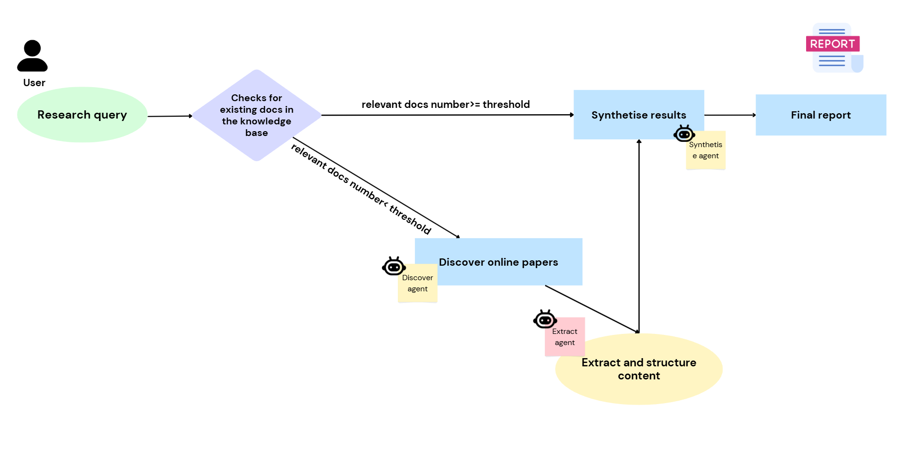

# Academic Research Assistant

An intelligent research platform that leverages AI agents and vector search to discover, analyze, and synthesize academic literature. This system provides comprehensive research assistance through automated paper discovery, content extraction, and intelligent analysis.

## 🌟 Features

- **Intelligent Paper Discovery**: Automated search across multiple academic databases
- **Smart Content Extraction**: AI-powered extraction from both text-based and scanned PDF papers
- **Comprehensive Analysis**: 9-point research analysis covering trends, gaps, and methodologies
- **Vector-Based Search**: Semantic similarity search using embeddings
- **Multi-Agent Architecture**: Specialized AI agents for discovery, extraction, and synthesis
- **Caching System**: Efficient session management and result caching

## 🏗️ Architecture

### System Components

#### Frontend
- **Framework**: Flask web application
- **Features**: Research query submission and result visualization

#### Backend 
- **Framework**: FastAPI for high-performance data processing
- **Orchestration**: LangGraph-based workflow management

#### Data Storage
- **Vector Database**: Chroma for embedding storage and similarity search
- **Cache**: Redis for session management and temporary data storage

#### External Integrations
- **Google Scholar**: Academic paper discovery
- **Semantic Scholar**: Enhanced metadata and citation analysis
- **ArXiv**: Preprint repository access

### Workflow Process


## 🤖 AI Agents

### Discovery Agent
- **Purpose**: Find relevant academic papers across multiple sources
- **Capabilities**: 
  - Multi-database search coordination
  - Relevance scoring and filtering
  - Metadata extraction

### Extract Agent
- **Purpose**: Process and structure document content
- **Capabilities**:
  - PDF text extraction (text-based and OCR)
  - Content structuring and cleaning
  - Key information identification

### Synthesis Agent
- **Purpose**: Generate comprehensive research analysis
- **Capabilities**:
  - 9-point analytical framework
  - Trend identification
  - Gap analysis
  - Methodology assessment

## 📊 Analysis Framework

The system provides a comprehensive 9-point analysis for each research topic:

1. **Knowledge Base Search**: Search and extract from existing PDF content
2. **Online Paper Discovery**: Identify relevant research papers
3. **Theme Identification**: Extract main research themes
4. **Activity Analysis**: Assess research field maturity and activity levels
5. **Challenge Extraction**: Identify key research challenges
6. **Gap Analysis**: Discover research opportunities
7. **Methodology Trends**: Analyze methodological approaches
8. **Citation Analysis**: Highlight top-cited papers
9. **Temporal Analysis**: Track research trends over time

## 🚀 Getting Started

### Prerequisites

```bash
Python 3.8+
Redis server
```

### Installation

1. **Clone the repository**
```bash
git clone https://github.com/Znullptr/Academic-Research-Assistant.git
cd Academic-Research-Assistant
```

2. **Setup project**
```bash
# Install Python dependencies
pip install -r requirements.txt

# Configure environment variables
cp .env.example .env
# Edit .env with your API keys and configuration
```

3. **Start Services**
```bash
# Start Redis
redis-server

# Start Fastapi and Flask
python main.py
python app.py
```

## 🔧 Technical stack

### Vector Search
- **Embedding Model**: Sentence transformers for semantic similarity
- **Similarity Threshold**: Configurable relevance scoring
- **Index Management**: Automatic embedding generation and storage

### Document Processing
- **Text Extraction**: Pymupdf for text-based PDFs
- **OCR Processing**: Tesseract for scanned documents
- **Html Processing**: BeautifulSoup for html bsed web content extract
- **Content Cleaning**: Automated formatting and structure detection

### Agent Coordination
- **Framework**: LangGraph for workflow orchestration
- **State Management**: Persistent workflow state tracking
- **Error Handling**: Robust fallback mechanisms

## 📈 Performance Comparison

### Scenario 1: No or few relevant docs found in Knowledge Base (Full Workflow)
When the system has no or few relevant documents for the user research query in the knowledge base, it executes the complete workflow including online paper discovery, content extraction, and analysis. This represents the peak processing time scenario.

**Processing Time**: ~5-8 minutes for comprehensive analysis


### Scenario 2: Found enough relevant docs in Knowledge Base (Optimized Workflow)
When enough relevant documents are already available in the knowledge base, the system leverages vector search for instant semantic similarity matching, dramatically reducing processing time.

**Processing Time**: ~1-2 minutes for comprehensive analysis
**Performance Improvement**: **80% faster** than empty knowledge base scenario


### Performance Benefits
- **Vector Search Efficiency**: Instant retrieval from pre-indexed documents
- **Reduced API Calls**: Minimal external database queries
- **Cached Analysis**: Leverages previously processed content
- **Semantic Matching**: Intelligent relevance scoring without full document processing

## 🔧 Performance Optimization Features

### Optimization Features
- **Parallel Processing**: Multi-threaded document processing
- **Caching Strategy**: Redis-based result caching
- **Batch Operations**: Efficient bulk document processing
- **Rate Limiting**: Respectful API usage patterns

### Benchmarks
- **Query Processing (No relevant docs )**: 5-8 minutes for full workflow execution
- **Query Processing (Populated KB)**: 1-2 minutes with 80% performance improvement
- **Document Indexing**: ~1000 papers/minute

## 📝 License

This project is licensed under the MIT License - see the [LICENSE](LICENSE) file for details.

---

**Note**: This system is designed for academic research purposes. Please ensure compliance with the terms of service of accessed academic databases and respect copyright regulations when using extracted content.
